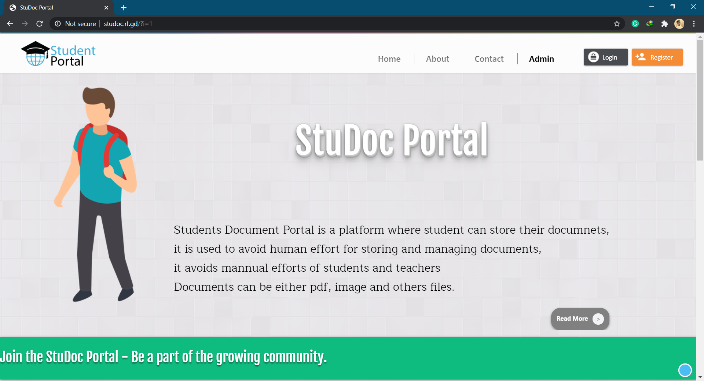
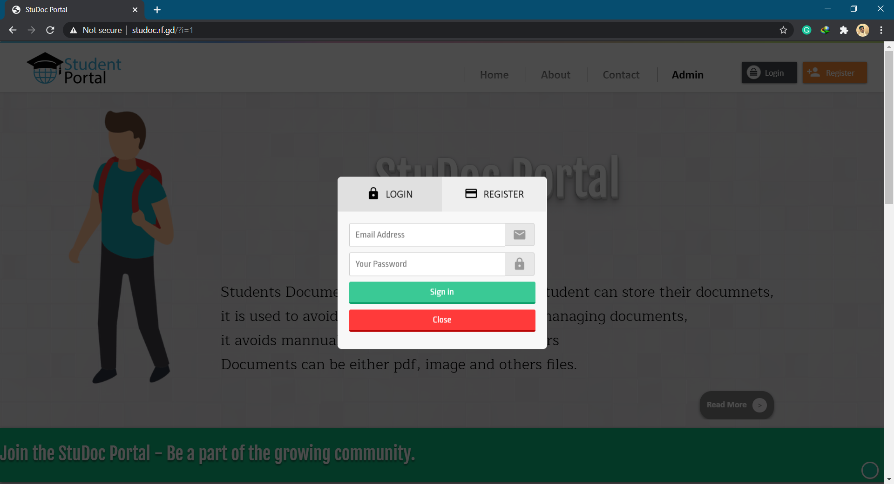
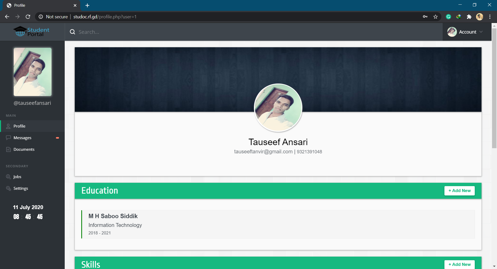
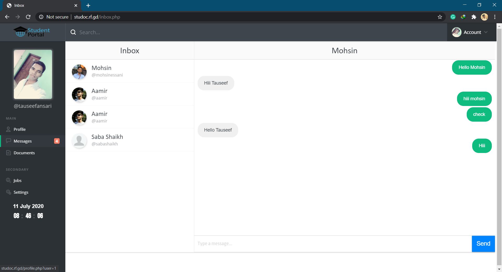

# Student-Documentation-Portal-Website
> Student Documentation portal with chat system and document storage system

## Purpose
The purpose of this document is to build an online system to manage student documents and to ease the student management system. It helps students in various ways such as providing all necessary documents at one place instead of searching everywhere. This saves human effort and time.

## Scope of project
Our StuDoc Portal can be used in colleges and even largest universities where manual effort of student as well as management authorities can be reduced to a greater extent by providing ease and having an on-demand access of documents at a glance.

## Snapshot of the project

## Hosted Website
You can access our [Student Documentation Portal](http://studoc.rf.gd/) any time as it is global solution for institute and placements
